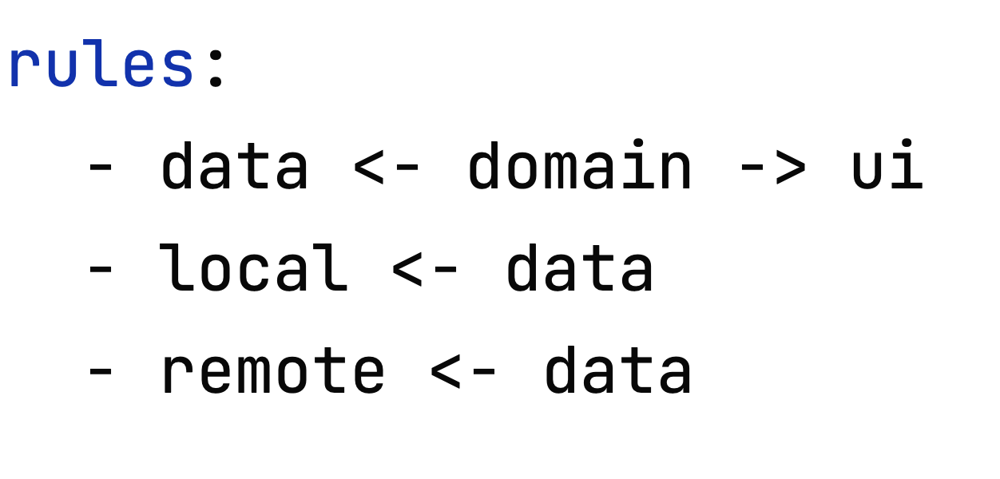
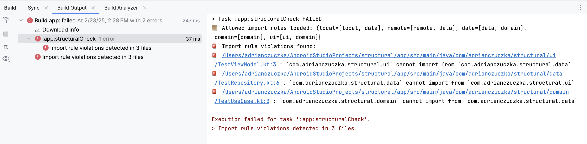

# Structural



---

A lightweight Gradle plugin for enforcing package dependency rules in Android & Kotlin projects.
Define which packages can import from others within your project and enforce it automatically.

Structural is intended to be a quick way to enforce a modular architecture when other tools are not
preferred or available. However, it can also be used for other purposes such as just forbidding one
local package from importing from another.

## Installation

---

```kts
plugins {
    id("com.adrianczuczka.structural") version "[version]"
}

repositories {
    mavenCentral()
}
```

## Usage

---

### Set the structure

Structural requires a YAML file to understand the intended package structure. First, create a YAML
file in your project. You can link it like this:

```kts
structural {
    config = "./structural.yml"
}
```

If you omit this, it will look for a `structural.yml` file by default in the root directory.

In your YAML file, there should be two main sections: `packages` and `rules`. `packages` should be a
list of all package names that Structural should check. For example, if you follow MVVM and Clean
Architecture rules, your list could look like this:

```yaml
packages:
  - local
  - remote
  - data
  - domain
  - ui
```

These are all the packages that will have rules related to which ones can import from which others.

The `rules` section should specify the rules which govern the package structure. There are two ways
to write these rules. You can either use arrows to specify the relationships, like this:
```yaml
rules:
  - data <- domain -> ui
  - local <- data
  - remote <- data
```
This means that
1. The `data` and `ui` folders can import from the `domain` folder, but not vice versa
2. The `local` and `remote` folders can import from the `data` folder, but not vice versa

The same rules can also be written like this:

```yaml
rules:
  
  # YAML lists are supported
  ? [ui, data]
    : - domain

  ? [local, remote]
    : - data

  # Also works
  ui:
    - domain
  data:
    - domain
  local:
    - data
  remote:
    - data
```

### Run the check

To check the validity of your module's folder structure, run:
```console
./gradlew structuralCheck 
```

An example result will look like this:
