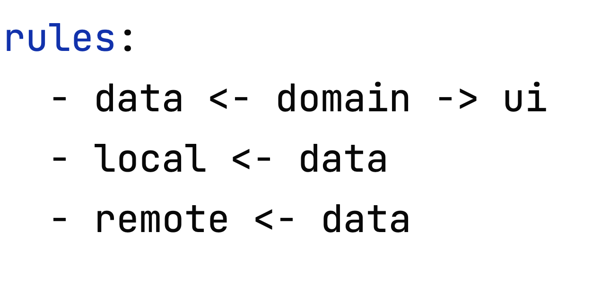
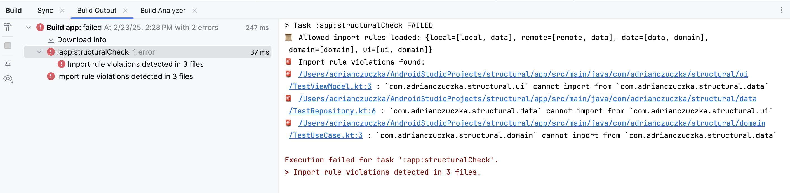

[](https://central.sonatype.com/artifact/com.adrianczuczka/structural)
[](https://github.com/adrianczuczka/structural/issues)
[](https://github.com/adrianczuczka/structural/actions)

# Structural



A small Gradle plugin for enforcing architectural boundaries between your packages — Clean
Architecture, MVVM, hexagonal, or whatever convention your project follows.

You write a YAML file describing which layers are allowed to import from which, and Structural
fails the build when something crosses a line. It works on Kotlin and Java sources and doesn't
require splitting your project into separate Gradle modules — useful when you want the boundaries
without the ceremony, or just want to stop one package from reaching into another.

Want to see it in action? The `kotlin-test-app/` and `java-test-app/` directories in this repo are
runnable examples (with intentional violations) that you can poke at.

## Quick start

If you'd rather just see the shape of it, here's the whole thing:

```yaml
# structural.yml in your project root
packages:
  - data
  - domain
  - ui

rules:
  - data <- domain -> ui
```

```bash
./gradlew structuralCheck
```

That config says `data` and `ui` may import from `domain`, but not the other way around — and `data`
and `ui` may not import from each other at all. Anything that breaks those rules fails the build.
The rest of this README explains the knobs.

## Installation

```kts
plugins {
    id("com.adrianczuczka.structural") version "<latest>" // see the Maven Central badge above
}

repositories {
    mavenCentral()
}
```

## Usage

### Configure the rules

Structural reads its configuration from a YAML file. By default it looks for `structural.yml` next
to your build file; if you'd rather keep it somewhere else, point at it explicitly:

```kts
structural {
    config = "./structural.yml"
}
```

The config has two main sections: `packages` (the layers you want to enforce) and `rules` (which
layers may import from which). For most projects, naming the layers by their last segment is all
you need:

```yaml
packages:
  - local
  - remote
  - data
  - domain
  - ui
```

A token like `data` (no dots) matches every file whose package *ends* in `.data` — for example
`com.example.app.data` and everything beneath it. That's almost always what you want for an
architectural rule like "nothing in `ui` may touch `data` directly."

The `rules` section is where you say who can import from whom. The arrow form reads naturally for
short rule sets:

```yaml
rules:
  - data <- domain -> ui
  - local <- data
  - remote <- data
```

`A <- B` reads "`A` may be imported from `B`" (data flows from `B` into `A`); `B -> A` means the
same thing. So the rules above say:

1. `data` and `ui` can import from `domain`, but not the other way around.
2. `local` and `remote` can import from `data`, but not the other way around.

Once you have more than a handful of rules the arrow form gets noisy, and you'll probably want the
map form. The key is the importer:

```yaml
rules:
  ui:
    - domain
  data:
    - domain
  local:
    - data
  remote:
    - data
```

If a bunch of packages share the same allowlist, YAML composite keys let you group them:

```yaml
rules:
  ? [ ui, data ]
    :
    - domain

  ? [ local, remote ]
    :
    - data
```

### Fully-qualified package names

The shorthand above breaks down in two situations: when two packages in your codebase share a last
segment (say `app1.data` and `app2.data` — the shorthand can't tell them apart), or when you want
to use wildcards (which aren't allowed on single-segment names). For either case, write the package
out in full:

```yaml
packages:
  - com.example.app.local
  - com.example.app.remote
  - com.example.app.data
  - com.example.app.domain
  - com.example.app.ui

rules:
  - com.example.app.data <- com.example.app.domain -> com.example.app.ui
  - com.example.app.local <- com.example.app.data
  - com.example.app.remote <- com.example.app.data
```

A bare path like `com.example.app.data` matches that path *and any of its subpackages*, so anything
under `com.example.app.data.**` lives by `com.example.app.data`'s rules. When more than one tracked
package matches a file, the longest match wins.

### Glob patterns

For fully-qualified package names, Structural supports Ant-style wildcards so you don't have to
spell out every subpackage by hand:

| Pattern | Matches |
| --- | --- |
| `com.example.foo` | `com.example.foo` and any subpackage (the default) |
| `com.example.foo.**` | same as above — explicit form, useful for readability |
| `com.example.foo!` | **only** `com.example.foo`, no subpackages |
| `com.example.*` | direct children of `com.example` only (`com.example.foo`, not `com.example.foo.bar`) |
| `com.*.api` | any `com.X.api` where `X` is a single segment |
| `com.**.internal` | any package under `com.` that ends in `.internal`, plus `com.internal` itself |
| `**.private` | any package ending in `.private`, plus `private` itself |

A few things worth knowing:

- `*` matches exactly one package segment.
- `**` matches zero or more.
- A trailing `!` pins the rule to that exact package and can't be combined with wildcards.
- Wildcards and `!` only work on dotted tokens — they're rejected on single-segment names
  like `data`.
- Each side of an arrow rule is parsed on its own, so `A! -> B.**` is fine.

Here's the example that prompted this feature: letting everything under `dev.ionfusion.runtime`
import from anything under `dev.ionfusion.runtime._private`.

```yaml
packages:
  - dev.ionfusion.runtime._private
  - dev.ionfusion.runtime

rules:
  - dev.ionfusion.runtime._private -> dev.ionfusion.runtime
```

Or, if you want to lock both sides down to the exact packages and ignore subpackages entirely:

```yaml
rules:
  - dev.ionfusion.runtime._private! -> dev.ionfusion.runtime!
```

### Class rules (additive)

Real codebases always seem to have a few cases where one specific class needs to cross a boundary
that the package rules don't allow — a shared exception, a builder, a handful of internals you're
mid-refactor on. The optional `classes:` section is for those: it lets you punch a class-shaped
hole through a package rule without weakening the package rule itself.

Class rules are **purely additive** — they can grant a cross-package import that package rules
would otherwise reject, but they can't take away an import that package rules already allow. Use
them sparingly, and prefer fixing the package boundary if the list starts growing.

```yaml
packages:
  - com.example.api
  - com.example.impl

rules: []   # api and impl cannot import each other by default

classes:
  - "com.example.api.** <- com.example.impl.FusionException"
  - "com.example.api.ApiBuilder <- com.example.impl.**"
  - "com.example.api.** <- com.example.impl._Private_*"
  - "com.example.api.** <- com.example.impl.**._Private_*"
```

(A future release may add a deny-exception form for the inverse case — granting most things and
carving out a few denials. Open an issue if you need it.)

#### Token grammar

Each side of a class rule is a token like `com.example.api.ApiBuilder`. Structural splits it into a
**package portion** and an optional **class portion**, working through these rules in order:

1. Any segment containing `*` (other than the whole-segment wildcards `*` and `**`) is the class
   name. So `com.example.impl._Private_*` parses as package `com.example.impl`, class
   `_Private_*`.
2. Otherwise, the first segment whose first non-underscore character is uppercase is the class
   name. So `com.example.api.ApiBuilder` parses as package `com.example.api`, class `ApiBuilder`.
   `_PrivateClass` counts because the first non-underscore character (`P`) is uppercase.
3. If neither of those matches (i.e. everything is lowercase), the whole token is a package
   pattern. `com.example.api.**` is package=`com.example.api.**`, class=any.
4. For the rare lowercase class name (a Kotlin typealias, a DSL receiver, etc.), prefix the
   trailing segment with `:` to force it: `com.example.api.:listOf` parses as package
   `com.example.api`, class `listOf`.

The package portion uses the [glob grammar above](#glob-patterns); the class portion supports
shell-style globs on a single identifier:

| Class pattern | Matches |
| --- | --- |
| `Foo` | exact match (case-sensitive) |
| `*Foo` | any name ending with `Foo` |
| `Foo*` | any name starting with `Foo` |
| `*Foo*` | any name containing `Foo` |
| `*` | any non-empty class name |

`**` is not a valid class-name pattern (class names are single identifiers); use the package
portion's `**` for cross-subpackage matching.

#### Map form

Same map form as `rules:`, with the importer as the key:

```yaml
classes:
  "com.example.api.**":
    - com.example.impl.FusionException
    - com.example.impl._Private_*
  "com.example.api.ApiBuilder":
    - com.example.impl.**
```

#### Known limitations

A few sharp edges worth knowing about up front:

- **The importing class's identity is its file name.** Structural is file-scoped, so a class rule
  on `com.example.api.ApiBuilder` matches a file called `ApiBuilder.kt`. If you've got an `Api.kt`
  that happens to *declare* `class ApiBuilder` inside it, the rule won't fire. The fix is usually
  to name the file after the class you care about.
- **Wildcard imports can't be granted by class rules.** `import com.foo.*` has no class name to
  match against, so class rules can't engage and the package-level rule applies as-is.
- **Java static imports are matched against the enclosing class.** So
  `import static com.foo.Util.LOG;` is granted by a rule on `com.foo.Util`, not one on
  `com.foo.LOG`.
- **Nested-class patterns aren't supported.** A token like `com.example.Foo.Bar` is rejected when
  the config is parsed. A rule on `Foo` will match `import Foo.Bar` by simple name (`Bar`); reach
  for a class glob on the imported side if you need finer control.
- **Kotlin object members.** `import com.foo.MyObject.member` is matched by simple name
  (`member`), not against the enclosing object. Kotlin's import directive doesn't tell us whether
  `member` is an object member or a top-level declaration, so treat them the same when writing
  rules.

### Run the check

```bash
./gradlew structuralCheck
```

When something's wrong, the output looks like this:



The task exits non-zero on violations, so it's safe to wire into CI. A common pattern is to make it
a dependency of `check` so it runs alongside your tests:

```kts
tasks.named("check") {
    dependsOn("structuralCheck")
}
```

### Setting a baseline

Adopting Structural on an existing codebase usually means a long initial list of violations.
Rather than fixing them all up front, you can snapshot the current state as a baseline and only
fail on *new* violations:

```bash
./gradlew structuralGenerateBaseline
```

That writes a baseline file (default: `$rootDir/baseline.xml`) listing the existing issues, which
`structuralCheck` will then ignore. Point at a different location with:

```kts
structural {
    baseline = "./baseline.xml"
}
```

Check the baseline into version control so the rest of your team gets the same behavior.

### Compatibility

Structural works on Kotlin and Java sources. The Kotlin parser runs in an isolated classloader,
which means the plugin uses its own bundled Kotlin compiler — so it doesn't matter what Kotlin
version your project uses (or whether you use Kotlin at all).